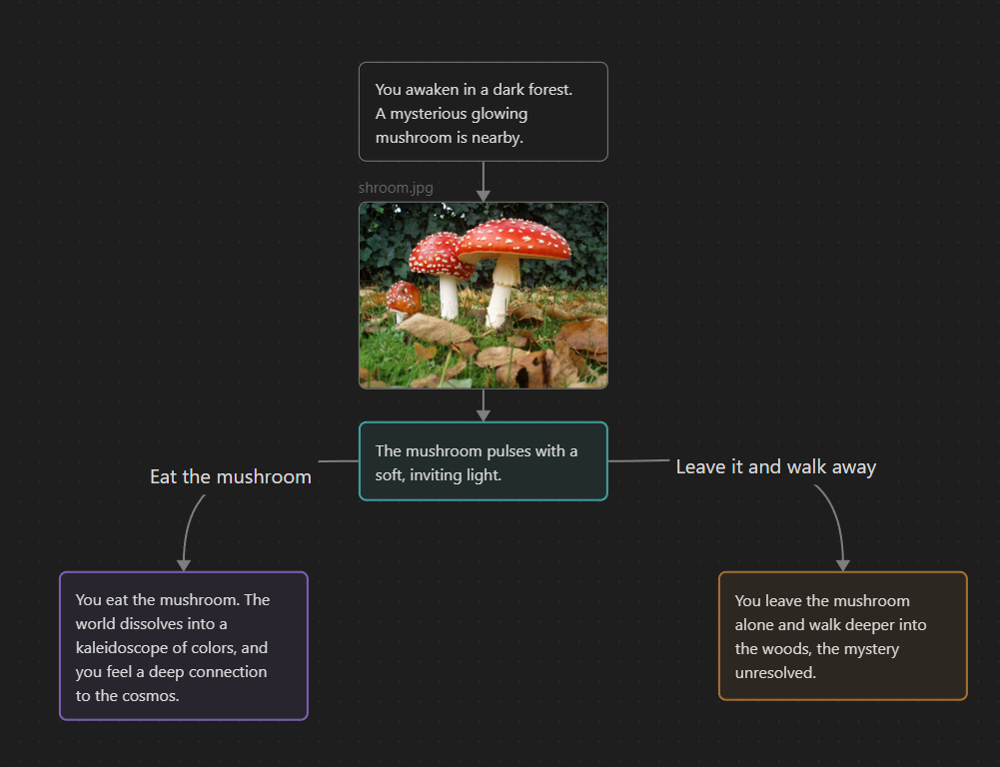

Kvass is a small graph interpreter for traversing JSON Canvas graphs.

It is intended for use within the Katzen visual novel engine, but a reference interpreter is provided here (as InteractiveInterpreter).